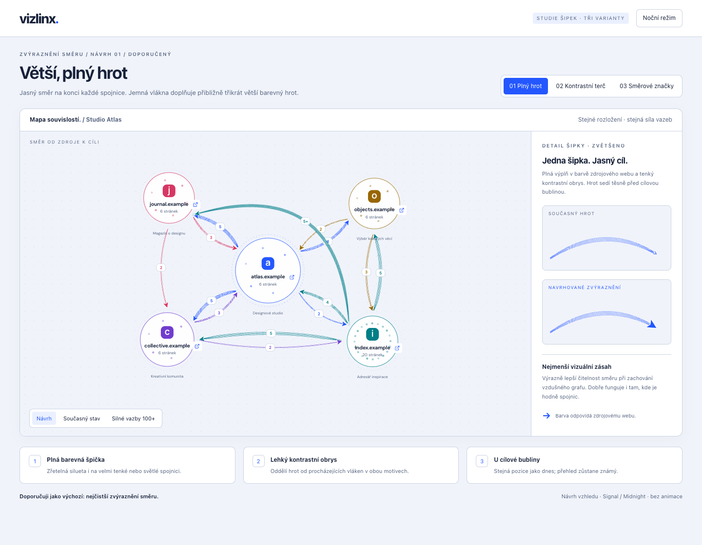
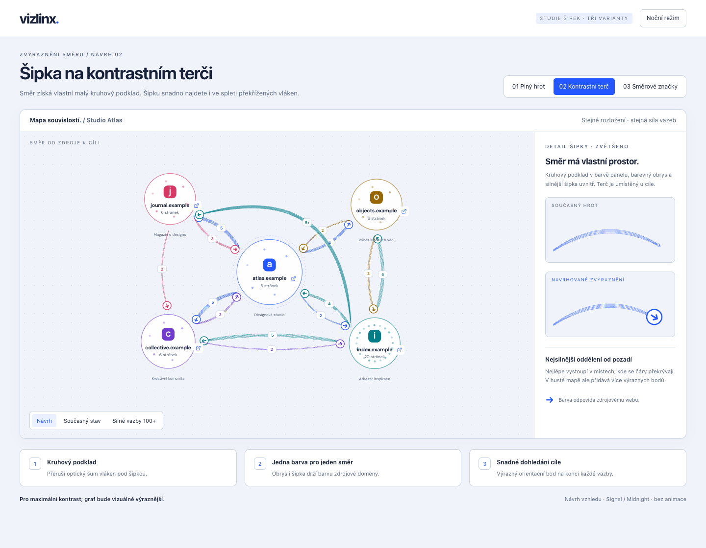
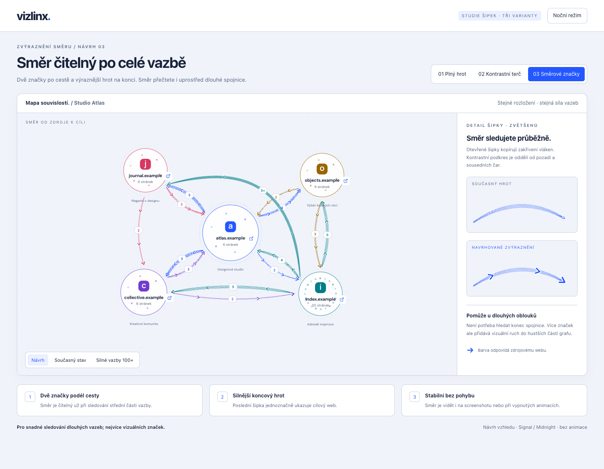

# Výraznější šipky v grafu

**Stav:** schváleno 2026-09-13 — varianta 1.

Směr odkazů má být snáze rozeznatelný ve světlém i tmavém tématu. Vybraná
varianta používá větší plný hrot v barvě zdroje s kontrastním obrysem. Platí
pro spojnice mezi doménami i odkazy rozbalených stránek. Sílu vazby dál
vyjadřují vlákna spojnice. Implementační pravidla jsou v [referenci frontendu](../02-frontend.md#styling-a-theming).

## Varianta 1 — schválená

## Další posuzované návrhy

