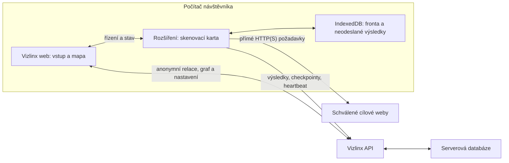

# Vizlinx.com — technická specifikace

> **Aktualizace 12. 9. 2026:** Pavel schválil přesun skenování na Cloudflare Workers + Queues, bez rozšíření, s pevným limitem 100 stránek na origin. Aktuální implementační kontrakt je v [serverovém prototypu](tasks/server-scan-prototype.md). Níže uvedená lokální architektura popisuje původní etapu; její požadavky na umístění exekuce byly nahrazeny.


Návrh pro [produktové zadání](product-specification.md). Potvrzené jsou lokální skenování v prohlížeči, serverové ukládání výsledků, vstup bez účtu a rychlost po doménách. Rozšíření pro Chrome bylo přijato 2026-09-12 pro první funkční prototyp. [Grafické demo](../README.md#stav) a skutečné mapy sdílejí React, TypeScript a SVG; hosting a API běží na Cloudflare Workers.

**Pořadí práce:** nejprve [grafické demo s ukázkovými daty](product-specification.md#první-milník-grafické-demo), potom technické PoC a funkční implementace vycházející z doladěného rozhraní. Níže popsaná architektura je návrh pro funkční produkt; její realizace není podmínkou grafického dema.

## Implementovaný prototyp a vztah k návrhu

Zdroj pravdy pro současné API je [kontrakt prototypu](tasks/local-scan-prototype.md), typy v `shared/scan.ts` a migrace v `migrations/`. Zbývající části dokumentu zachycují širší návrh a budoucí rozšíření.

| Oblast | Současná implementace |
| --- | --- |
| Graf | Stávající SVG mapa, Signal/Midnight, Silk; stabilní identity a ruční pozice při příchodu výsledků |
| Rozsah | 3 přesné HTTP(S) originy, 50 stránek na origin; bez PSL agregace |
| Runner | Otevřená karta Chrome MV3, jeden globální Web Lock a sériové požadavky; bez serverového lease |
| Obnova | `chrome.storage.local`: fronta a outbox; identický upload je idempotentní; heartbeat 10 s, přerušení po 90 s |
| Ukládání | Celý strukturovaný výsledek stránky do 256 KiB v jedné D1 transakci; bez chunků a historie pokusů |
| Limity | HTML 2 MiB, 500 skupin odkazů a 500 objevených URL na stránku, 4 MiB výsledků na sken |
| Retence | Čtení jen 30 dní od založení skenu a s platnou relací; omezený fyzický úklid při zakládání relace/mapy |
| Ochrana kapacity | Denně 20 nových relací a 50 skenů na hash IP; globálně 1 000 skenů a 10 000 relací |
| Párování | Cookie vlastní mapu, ticket 60 s, rotovaný token omezený na sken 24 h; prod bridge jen apex a www |
| Síť | Bez cookies, automatických redirectů, JS renderingu a serverového fetch cílových webů |

Rozšíření je pro ruční instalaci v desktopovém Chrome. Ověření na kontrolovaných fixture webech a izolovaném Chromiu nenahrazuje veřejné vydání ani záruku proti DNS rebindingu. Návod a konkrétní testy jsou v [README rozšíření](../extension/README.md).

## Proveditelnost v prohlížeči

JavaScript běžící na `vizlinx.com` nemůže obecně přečíst HTML jiného webu bez jeho CORS povolení. `fetch(..., { mode: "no-cors" })` vrací neprůhlednou odpověď bez přístupného těla, takže z ní nejdou extrahovat odkazy. Web Worker ani PWA toto oprávnění nepřidají. [MDN: Fetch](https://developer.mozilla.org/en-US/docs/Web/API/Fetch_API/Using_Fetch), [MDN: Response.type](https://developer.mozilla.org/en-US/docs/Web/API/Response/type).

Chrome dovoluje cross-origin požadavky z kontextu rozšíření s povolenými hosty. Samotný content script na navštíveném webu zůstává pod omezeními jeho originu. Doporučená varianta proto používá samostatnou stránku rozšíření pro skenování. [Chrome: Cross-origin network requests](https://developer.chrome.com/docs/extensions/develop/concepts/network-requests).

| Varianta | Exekuce u návštěvníka | Hranice |
| --- | --- | --- |
| Běžná webová stránka | Ano | Jen cíle umožňující čtení přes CORS |
| Web + rozšíření | Ano | Instalace a povolení hostů; doporučený návrh |
| Web + lokální aplikace | Ano | Instalace samostatné aplikace; alternativa |
| Serverový crawler / proxy | Ne | Nesplňuje zadané umístění exekuce |

Vložení webu do iframe ani otevření cizí karty nedává Vizlinx právo přečíst její DOM. [MDN: Same-origin policy](https://developer.mozilla.org/en-US/docs/Web/Security/Defenses/Same-origin_policy). Rozšíření neznamená automatické obejití CAPTCHA či antibot ochrany. Požadavky používají návštěvníkovo síťové připojení, případně jeho VPN/proxy; nelze slibovat konkrétní veřejnou IP.

## Architektura



Backend přijímá data a odpovídá na dotazy nad uloženými výsledky. Nemá crawler, proxy endpoint ani serverový fallback pro chybějící stránky. Ani favicony, screenshoty či robots.txt nesmí začít automaticky stahovat z cílových webů. První verze používá pro domény textové značky.

### Navržený stack

| Část | Návrh | Role |
| --- | --- | --- |
| Web | TypeScript, React + Vite | Vstup, nastavení, průběh a mapa |
| Graf | Cytoscape.js | Směrové hrany a stránky v doménových clusterech |
| Skener | Chrome/Edge rozšíření Manifest V3 | Lokální scheduler, fetch a extrakce |
| HTML parser | parse5, zabalený do rozšíření | Parsování bez spuštění skriptů a načítání zdrojů |
| Lokální data | IndexedDB | Fronta, checkpoint a outbox |
| API a hosting | Cloudflare Workers + Static Assets | Web a API pod jedním originem |
| Serverová data | Cloudflare D1 | Relace, skeny, stránky a odkazy |

Cloudflare dokumentuje nasazení React + Vite se Static Assets a API ve Workeru. D1 poskytuje relační SQL úložiště. Tato kombinace je návrh pro omezené MVP, ne potvrzená kapacita pro veřejný neomezený provoz. [React + Vite](https://developers.cloudflare.com/workers/framework-guides/web-apps/react/), [Static Assets](https://developers.cloudflare.com/workers/static-assets/), [D1](https://developers.cloudflare.com/d1/).

Cytoscape.js podporuje vnořené uzly, ale automaticky neřeší celý přechod mezi agregovanými doménami a stránkami. Ten bude součástí aplikace. Vnořené uzly zvyšují cenu renderování; ověřit prototypem před definitivní volbou. [Cytoscape.js: Compound nodes](https://js.cytoscape.org/#notation/compound-nodes).

## Anonymní identita a oprávnění

Bez účtu neznamená bez autentizace.

1. První použití vytvoří anonymní `visitor`. Server nastaví náhodnou neprůhlednou session cookie `HttpOnly; Secure; SameSite=Lax`; v databázi uchová její hash.
2. Každý sken vlastní konkrétní návštěvník. API vždy ověřuje vlastníka, i když volající zná `scan_id`.
3. Stavové požadavky z webu ověřují origin a CSRF ochranu. Čtení soukromých map nemá veřejnou cache.
4. Spárování rozšíření použije jednorázový ticket s platností 60 sekund, vydaný přihlášené anonymní relaci pro konkrétní sken.
5. Rozšíření ticket vymění za odvolatelný token omezený na daný sken: čtení manifestu, nahrávání výsledků a aktualizace průběhu. Nemůže mazat mapu ani přistupovat k jiným skenům.
6. Ticket ani token nepatří do query parametrů, běžných logů nebo uloženého HTML. K expiraci skenu se zruší i tokeny. Návrh životnosti párovacího tokenu je 24 hodin; nové párování proběhne ze stále platné webové relace.

Ztráta anonymní session znamená ztrátu přístupu, pokud nebude doplněn recovery mechanismus. Instalace rozšíření sama nezakládá nový přístup k dřívějším mapám. Serverová retence je navržena na 30 dní od posledního použití; server ji vynucuje i při čtení, fyzický úklid provede pravidelná úloha bez požadavků na cílové weby.

## Propojení webu a rozšíření

Web posílá jen příkazy pro konkrétní sken, například `pairScan`, `pauseScan` a `getRunnerStatus`. Rozšíření nepřijímá obecný příkaz „stáhni libovolnou URL“.

Použít pevně určené ID produkčního rozšíření a `externally_connectable` omezené na `https://vizlinx.com/*`. Kontrolovat skutečný origin odesílatele, schéma zprávy, sken i jednorázový ticket. Manifest skenu načíst z API, zobrazit jeho domény ve skenovací kartě a teprve tam vyžádat souhlas s hosty. [Chrome: Message passing](https://developer.chrome.com/docs/extensions/develop/concepts/messaging#external-webpage).

Oprávnění se žádají z kliknutí v rozšíření pomocí `optional_host_permissions` a `chrome.permissions.request()`. Povolit jen vybrané originy, nikoli všechny weby při instalaci. Odvolání oprávnění za běhu doménu pozastaví. [Chrome: permissions](https://developer.chrome.com/docs/extensions/reference/api/permissions).

## Životní cyklus skeneru

Scheduler a fetch běží v samostatné otevřené stránce rozšíření, ne v krátkodobém popupu. Service worker rozšíření slouží pro obsluhu událostí a otevření této karty. Nelze spoléhat na nekonečnou smyčku a globální proměnné service workeru; Chrome ho může při nečinnosti ukončit. [Chrome: Service worker lifecycle](https://developer.chrome.com/docs/extensions/develop/concepts/service-workers/lifecycle).

- Stav fronty a outbox se průběžně transakčně ukládá do IndexedDB.
- Jeden návštěvník má v MVP jeden aktivní runner; různé mapy lze prohlížet současně.
- Druhá karta nemá zdvojnásobit rychlost. Lokální zámek a serverový lease návštěvníka určují jednoho vlastníka běhu.
- Návrh lease: 60 sekund, heartbeat každých 15 sekund. Bez prodloužení runner před vypršením přestane spouštět nové požadavky.
- Po zavření skenovací karty nebo usnutí zařízení server po vypršení heartbeat označí běh jako přerušený. Nelze spoléhat na doručení události při zavírání.
- Při návratu se nedokončené fetch pokusy vrátí do fronty; již uložené outbox položky se jen odešlou.
- Browser může kartu zpomalit či zahodit. Interval je dolní mez mezi požadavky, ne garance přesného tempa.
- Pauza ihned zakáže nové požadavky. Již běžící požadavek smí dokončit; požadavek na úplné zastavení použije AbortController.
- Zavření samotné webové mapy nemusí zastavit otevřenou skenovací kartu; toto chování musí být v UI srozumitelné.

## Domény, rozsah a URL

### Rozdělení clusteru a oprávnění

`site_key` je registrovatelná doména podle Public Suffix List včetně privátních suffixů. Konkrétní parser a verzi seznamu zafixovat v implementaci. `allowed_origins` jsou jednotlivé schválené originy. Vizuální příslušnost ke clusteru není oprávněním ke stažení. [Public Suffix List](https://publicsuffix.org/list/).

Při vstupu bez schématu použít HTTPS. `www`, apex, HTTP a HTTPS jsou samostatné originy pro kontrolu oprávnění. Nabídnout rozšíření rozsahu při potřebě přechodu, nepovolovat hosty pouze podle shody konce řetězce.

### Normalizace

Sdílený balíček klient/server:

- Zpracovat URL standardním parserem, relativní `href` vyhodnotit proti URL odpovědi a prvnímu platnému `base href`.
- Normalizovat velikost písmen hostname, výchozí porty a odstranit fragment pro identitu stránky.
- Zachovat velikost písmen cesty, trailing slash a query parametry. Automaticky neslučovat `/produkt` a `/produkt/`, neodstraňovat neznámé parametry.
- `rel=canonical` uchovat jako metadata, nepovažovat za automatický příkaz ke sloučení.
- Evidovat původní rozřešenou cílovou URL odkazu zvlášť od případné finální URL po přesměrování. Vazba má dokazovat skutečné `href`.
- Vynechat `mailto:`, `tel:`, `javascript:`, `data:` a lokální soubory. HTTP(S) URL s vloženými přihlašovacími údaji neprocházet.

Konkrétní pravidla deduplikace query variant a vyloučených cest jsou konfigurovatelná pro doménu; jejich výchozí stav nemění význam URL.

## Objevování stránek a řízení rychlosti

Seedem je vložená stránka; při zadání domény její kořen. Procházení do šířky přidává odkazy ze stažených stránek do fronty pouze v povoleném rozsahu. Interní odkazy jsou nutné pro objevování dalších zdrojových stránek, i když nejsou ve výchozí mapě vidět.

Odkaz na jinou již schválenou doménu se zařadí do její fronty. Když uživatel později přidá další doménu, po povolení jejích originů lze jako seedy využít i cílové URL již uložené v mapě.

Pro každou doménovou skupinu udržovat:

```text
interval_ms
next_allowed_at
in_flight
max_pages
attempted_pages
queue
paused
backoff_until
```

`interval_ms` je minimum mezi začátky HTTP požadavků, nejen mezi dokončenými HTML stránkami. Všechny schválené hosty jednoho clusteru sdílejí tento rozpočet. Robots požadavky, retry i přesměrování jím také musejí projít.

Výchozí scheduler: 3 sekundy, souběh 1 na doménu a 3 globálně, střídání připravených domén bez vyhladovění. Změna nastavení přepočítá další povolený start. Po usnutí se požadavky nedohánějí nárazově.

`robots.txt` načíst lokálně pro každý origin před procházením. Uplatnit pravidla RFC 9309; chybové stavy nejsou všechny „povoleno“. V MVP aplikovat pravidla pro `*`, dokud není otestována konzistentní identita crawleru. `Crawl-delay` je případné konzervativní rozšíření, nikoli direktiva definovaná tímto RFC. [RFC 9309](https://www.rfc-editor.org/rfc/rfc9309.html).

Sitemap discovery je pozdější rozšíření. První verze neslibuje nalezení osiřelých stránek bez interních odkazů.

### Chyby a limity

| Situace | Reakce |
| --- | --- |
| HTTP 429 | Respektovat platné Retry-After, jinak exponenciální čekání; pozastavit doménu po 3 neúspěšných pokusech |
| Síťová chyba / 5xx | Nejvýše 2 retry s rostoucí prodlevou a náhodným rozptylem |
| HTTP 401/403, CAPTCHA | Zastavit doménu s důvodem, bez automatického obcházení |
| HTTP 404/410 stránky | Uložit stav; stránku dále neprocházet |
| Timeout | Po 20 sekundách zrušit; retry podle síťové chyby |
| Ne-HTML odpověď | Uložit typ a stav, neparsovat jako HTML |
| Příliš velká stránka / fronta | Zastavit nebo zkrátit zpracování s explicitním důvodem |

Navržené ochranné limity MVP: 5 MiB rozbaleného HTML na odpověď, 5 000 odkazů na stránku, 100 000 uložených výskytových skupin na sken a 10 000 čekajících URL na sken. Nadlimitní výsledky se nesmějí tiše tvářit jako úplné. URL nad 4 096 znaků a text nad 512 znaků mají příznak odmítnutí či zkrácení. Úspěšná i neúspěšná první návštěva URL spotřebuje limit stránek; retry má navíc samostatný pevný strop.

## Přesměrování a bezpečný síťový rozsah

Základní fetch: GET, bez přihlašovacích údajů a cookies cílového webu (`credentials: "omit"`), s timeoutem a bez načítání subresources.

Nepoužívat nekontrolované automatické následování přesměrování: mohlo by překročit rozsah i interval. V PoC ověřit, zda zvolený extension kontext dovolí získat redirect status a Location. Běžný Fetch při `redirect: "manual"` může vrátit `opaqueredirect` bez čitelné hlavičky. [MDN: Response.type](https://developer.mozilla.org/en-US/docs/Web/API/Response/type).

Bez prokázané implementace bezpečných redirectů MVP uloží `redirect_unresolved` a nabídne uživateli přidat finální URL. Pokud Location číst půjde, každý hop znovu ověřit a zařadit přes scheduler; nejvýše 5 hopů. Zamítnout nový host bez uděleného oprávnění.

Skener přijímá pouze explicitně schválené veřejné hosty na standardních HTTP(S) portech. Neprochází localhost, privátní/link-local IP literály, single-label hosty ani interní rozsahy. Řetězcový filtr hostu sám nezaručuje ochranu proti DNS rebindingu; ověření aktuálních síťových omezení Chrome pro rozšíření je součástí PoC a podmínka veřejného vydání. Do té doby se neslibuje bezpečné skenování libovolného nedůvěryhodného hostu.

## Extrakce odkazů

HTML zpracovat lokálně parserem parse5 na datový strom. Parser je zabalený do rozšíření, nespouští kód z webu. DOMParser nevkládat do živého dokumentu; i oddělený dokument může načítat některé zdroje, proto zde preferujeme parser bez browserového DOM. [parse5](https://parse5.js.org/), [MDN: DOMParser](https://developer.mozilla.org/en-US/docs/Web/API/DOMParser/parseFromString).

Zpracovat `a[href]` a `area[href]`. Každý výskyt nese:

```text
source_url
target_url
target_page_key
target_site_key
anchor_text
rel_tokens
region: content | navigation | footer | unknown
occurrence_count
observed_at
```

`anchor_text` vznikne z textu, případně z alt textu obrázku; whitespace se normalizuje. Region je heuristika podle HTML předků, ne garantované rozpoznání šablony. Skripty, styly, obrázky a formulářové akce nejsou odkazové hrany. `nofollow`, `sponsored` a `ugc` jsou metadata, odkaz se kvůli nim nezahazuje.

Do serverových dat patří všechny nalezené externí odkazy, nejen vazby na předem vybrané weby. Interní cíle se ukládají do seznamu objevených stránek pro obnovení fronty; detailní interní hrany nejsou pro MVP vizualizaci potřeba.

Server obdrží strukturované výsledky, nikoli celé HTML, cookies nebo přihlašovací stav. Texty a URL se v aplikaci vykreslují jako data; cizí HTML se nespouští. Veřejně dostupné stránky s JavaScriptem mají v MVP pouze výsledek `static_html`; vykreslený DOM je samostatný budoucí režim, protože přidává subrequesty, cookies a obtížnější řízení rychlosti.

## Datový model

Logický návrh, nikoli hotová SQL migrace. Identifikátory jsou strojová data aplikace; vault používá běžné názvy dokumentů.

| Entita | Podstatná pole |
| --- | --- |
| visitors | id, session_hash, expires_at, active_runner_lease |
| scans | id, visitor_id, status, config_version, created_at, expires_at |
| scan_sites | scan_id, site_key, allowed_origins, seeds, interval_ms, max_pages, state |
| scan_pages | scan_id, site_key, normalized_url, discovery_source, crawl_status, attempt_count, active_result_id |
| page_results | id, scan_id, source_page_id, attempt_id, status, final_url, fetched_at, received_at, mode, completeness, commit_state |
| link_occurrences | result_id, target_url, target_page_key, target_site_key, anchor_text, rel_tokens, region, occurrence_count |
| ingest_chunks | result_id, chunk_index, payload_hash, stored_at |

`scan_pages` obsahuje objevené URL v povoleném rozsahu. Neprozkoumané externí cíle stačí uložit v odkazech; graph API z nich vytvoří cílové uzly. Je-li cíl současně v `scan_pages`, doplní jeho skutečný stav. Uzel v grafu sám o sobě není záznam úspěšného fetch.

Unikátnost: stránka = `(scan_id, normalized_url)`; pokus = `(scan_id, source_page_id, attempt_id)`; upload chunk = `(result_id, chunk_index)`. Odkazová skupina uvnitř výsledku používá cílovou URL, text, normalizované rel a region. Stejné zdrojové a cílové stránky se v doménové agregaci počítají pouze jednou.

Indexy pro dotazy: stránky podle skenu a stavu; výsledky podle skenu a zdrojové stránky; odkazy podle výsledku a cílové domény. Všechny dotazy jsou omezené `scan_id` a ověřeným vlastníkem. Nový kompletní výsledek nahrazuje předchozí aktivní výsledek zdrojové stránky, nikoli přičítá jeho hrany podruhé.

## Odesílání, potvrzení a obnova

1. Výsledek a nově objevené interní cíle uložit atomicky do lokálního outboxu před označením stránky za lokálně dokončenou.
2. Rozdělit výsledek do očíslovaných chunků, návrh nejvýše 100 skupin a 256 KiB na chunk.
3. Odesílat po dokončení stránky; více drobných výsledků lze sloučit v intervalu do 2 sekund.
4. Server přijaté chunky uloží jako staging. Stejný index se stejným hashem vrátí stejný výsledek; jiný obsah pro stejný index je konflikt.
5. Finalizace ověří úplnost chunků a manifest výsledku. Teprve potom atomicky přepne `active_result_id` stránky a zpřístupní hrany grafu.
6. Serverové ACK přijde po trvalém zápisu. Až pak odstranit položku z outboxu a lokálně potvrdit synchronizaci.
7. Při výpadku API zachovat outbox. Po 30 sekundách neúspěšného ukládání nebo při lokálním limitu pozastavit nové fetch; neskenovat dál bez omezení.
8. Po restartu nejprve dosynchronizovat outbox, potom porovnat stavy se serverem a obnovit frontu. Server má objevené interní URL z potvrzených výsledků.
9. Po ztrátě IndexedDB lze se stále platnou anonymní relací obnovit alespoň serverový checkpoint. Neodeslané výsledky jsou ztracené a zdrojové stránky se mohou stáhnout znovu.

MVP nevyžaduje serverové rozdělování crawlerových úloh mezi více návštěvníků ani společnou veřejnou databázi nálezů. Jeden sken patří jednomu návštěvníkovi; cizí výsledky se do něj automaticky nepřimíchávají.

### D1 zápisy a kapacita

Použít připravené dotazy a dávky s malými statements. D1 má limit 100 vázaných parametrů na jeden dotaz; 100 odkazů proto nelze automaticky zapsat jedním mnohosloupcovým INSERT. Chunkování, finalizaci a limity dotazů ověřit na skutečném runtime. [D1 limits](https://developers.cloudflare.com/d1/platform/limits/).

Cena závisí i na počtu čtených a zapisovaných řádků a indexech. Před veřejným vydáním změřit náklady na sken o 5 000 stránkách a 100 000 odkazových skupinách; neslibovat provoz v bezplatném tarifu. [D1 pricing](https://developers.cloudflare.com/d1/platform/pricing/).

## API kontrakt

Verzované JSON API `/api/v1`, validace sdílených schémat na klientu i serveru. Web používá cookie, rozšíření token omezený na sken.

| Endpoint | Účel |
| --- | --- |
| POST /session | Vytvořit či obnovit anonymní relaci |
| POST /scans | Vytvořit sken, seed URL a konfiguraci webů |
| GET /scans | Seznam map vlastníka |
| GET /scans/:id | Stav, limity a manifest |
| PATCH /scans/:id/sites/:siteId | Interval, pauza a schválený rozsah |
| POST /scans/:id/pairing-ticket | Jednorázové spárování rozšíření |
| POST /runner/exchange | Výměna ticketu za omezený token |
| POST /scans/:id/lease | Získat či prodloužit vlastnictví běhu |
| PUT /scans/:id/results/:resultId/chunks/:index | Idempotentní upload |
| POST /scans/:id/results/:resultId/commit | Finalizace výsledku |
| GET /scans/:id/pages?status=queued&cursor=… | Serverový podklad pro obnovu fronty |
| GET /scans/:id/graph?level=domains | Agregovaný graf |
| GET /scans/:id/graph?level=pages&sites=…&cursor=… | Stránky vybraných clusterů |
| GET /scans/:id/links?source=…&target=…&cursor=… | Detailní tabulka |
| GET /scans/:id/export.csv | Export výsledků s filtry |
| DELETE /scans/:id | Zrušit tokeny a odstranit vlastní sken |

Heartbeat předává lokální stav fronty a dostává aktuální `config_version`. Přidání originu na serveru samo nepovolí jeho procházení; rozšíření vyžádá souhlas uživatele. Server ukládá průběžná hlášení chyb i u běhů bez jediné úspěšné stránky.

Při změně intervalu či pauzy otevřený web zároveň upozorní runner zprávou, aby načetl novou konfiguraci hned. Heartbeat je záloha pro doručení změny; UI do potvrzení ukazuje, že se změna teprve aplikuje. Pozastavení v samotné skenovací kartě platí lokálně okamžitě.

Klientem dodané údaje nejsou důvěryhodný důkaz existence odkazu. API ověřuje vlastníka, povolený zdroj, formát URL, velikosti a kvóty; cílové externí URL mohou být mimo rozsah. Přijatá data se označují původem `client_reported`. CORS není autentizace. Cloudflare administrátorský token nikdy nepotřebuje návštěvník ani rozšíření.

## Graf a agregace

Doménová hrana A → B = počet unikátních dvojic `source_page_key → target_page_key` z aktivních potvrzených výsledků. Vedle toho API vrací počet výskytů a zdrojových stránek. Čas pozorování a příznaky neúplnosti zůstávají dohledatelné.

- Doménový přehled načítat samostatně; nenačítat všechny stránky a hrany do browseru před prvním vykreslením.
- Zoom nebo explicitní rozbalení načte pouze vybrané clustery a jejich relevantní vazby.
- Zvolit stabilní pozice domén a lokální rozmístění jejich stránek. Příchod výsledku nesmí vždy spustit přepočet celého grafu.
- Pokud je rozbalená pouze jedna strana, agregovat hrany z jejích stránek do protějšího doménového uzlu.
- Mezi režimy použít odlišný práh rozbalení a sbalení, aby se při malých změnách zoomu nepřepínaly sem a tam.
- MVP aktualizuje stav pollingem po 3 sekundách během běhu; po dokončení automatický polling skončí.
- Pracovní limit jedné vizualizace: 500 stránkových uzlů a 2 000 hran. Nad ním zobrazit výběr a počet skrytých prvků; tabulka a CSV zůstávají úplné v rámci uložených dat.

Cílová odezva UI je návrh k měření: interakce do 100 ms a první doménový graf do 2 sekund od dostupnosti dat na referenčním notebooku. Počet prvků není záruka výkonu knihovny.

## Etapy implementace a ověření

1. **Grafické demo:** hlavní obrazovka, doménové clustery, směrové vazby, zoom na stránky a detail propojení nad pevnými ukázkovými daty. Pouze frontend a lokální stav; doladit vzhled a ovládání s Pavlem podle kritérií v produktovém zadání.
2. **PoC proveditelnosti skeneru:** po doladění dema rozšíření načte HTML kontrolovaného webu bez CORS, bez cookies a bez serverového fetch. Ověří permissions, redirecty, síťový rozsah, uspání a návrat. Přijatelnost instalace je produktová podmínka.
3. **Svislý průchod:** anonymní relace → 2 domény → lokální fronta → extrakce → idempotentní upload → tabulka a doménový graf v rozhraní vycházejícím z dema.
4. **Spolehlivost:** rychlost po doménách, robots, limity, chyby, lease, restart a obnovení. Simulovat ztrátu ACK po serverovém zápisu.
5. **Detail mapy nad skutečnými daty:** napojit interakce z dema na průběžné výsledky a postupné načítání clusterů, ověřit výkon a doplnit hledání a export.
6. **Před veřejným vydáním:** kontrola rozsahu oprávnění, izolace relací, ukládání tokenů, škodlivého HTML, DNS/redirect chování a kapacity D1. Ověřit distribuci rozšíření a měření nákladů.

Ověření použije kontrolované fixture weby, ne plošné testovací skenování cizích domén. Zvláštní případy: dvě stejné kotvy na stránce, patička napříč 300 stránkami, relativní URL s base, query varianty, 429, opaque redirect, JS-only odkaz, druhá karta a cizí anonymní session.

## Neuzavřené technické body

- Přijetí rozšíření a prohlížečů podporovaných v první verzi.
- Redirect metadata a veřejný síťový rozsah v konkrétní verzi Chrome/Edge.
- Výkon grafu na reálných datech, zvolené kvóty a náklady serverového úložiště.
- Přesný lifecycle anonymní relace a požadavek na obnovu či sdílení.
- Nutnost renderování JavaScriptu už v první verzi.

Tyto body nepřeklápět do tvrzení „ověřeno“ bez PoC nebo produktového rozhodnutí. Potvrzené umístění exekuce zachycuje [rozhodnutí o lokálním skenování](decisions/browser-side-crawling.md).
